# Android FIT 导入流程对齐 iOS 方案

## 一、两端导入流程对比

```mermaid
flowchart TD
    subgraph iOSFlow [iOS 导入流程 - 10 步]
        A1[1.解析前去重 originId+datasource] --> A2[2.解析FIT文件]
        A2 --> A3[3.转换RunRecordata - 含Session回退]
        A3 --> A4[4.解析后去重 hkUUid]
        A4 --> A5[5.保存RunRecord - 含优先级管理]
        A5 --> A6[6.转换训练分段 - 含类型推断引擎]
        A6 --> A7[7.计算VDOT - 支持间歇训练]
        A7 --> A8["8.保存详细数据(SeriesData+Event+Segment+Route+Zone+PB)"]
        A8 --> A9[9.生成简化轨迹]
        A9 --> A10[10.解析地理位置]
    end

    subgraph androidFlow [Android 当前流程 - 6 步]
        B1[1.获取文件名] --> B2[2.解析FIT文件]
        B2 --> B3[3.去重检查 originId]
        B3 --> B4[4.转换RunRecordEntity]
        B4 --> B5[5.转换SamplePoint+Segment]
        B5 --> B6["6.保存(zones=空)"]
    end
```

## 二、Android 端缺失的 10 项关键逻辑

### 缺失 1: 暂停事件(Event)转换 -- 优先级: 高

iOS 在 [`GarminFitEventConverter.swift`](zrun/ZhiRun1/managers/fitfile/converters/GarminFitEventConverter.swift) 中将 FIT 的 timer stop/start 事件配对，生成 `eventStr` JSON 存入 RunRecord。Android 的 `RunRecordEntity` 已有 `eventStr` 字段但**从未填充**。

**影响**: 暂停事件缺失导致分段 activeDuration 计算不准确、心率区间计算错误。

### 缺失 2: Session 数据回退(Fallback) -- 优先级: 高

iOS 在 [`GarminFitDataConverter.swift:113-138`](zrun/ZhiRun1/managers/fitfile/GarminFitDataConverter.swift) 中，当 Session 级别的 `averageVerticalOscillation` 或 `averageContactTime` 为 0 时，会从 Record 级别数据计算平均值（COROS 等设备常见）。Android 的 [`FitDataMapper.kt`](rundemo/src/main/java/com/oterman/rundemo/data/fit/FitDataMapper.kt) **没有这个回退逻辑**。

### 缺失 3: 训练模式下额外计算公里分段 -- 优先级: 高

iOS 在 [`GarminFitImportService.swift:246-270`](zrun/ZhiRun1/managers/fitfile/GarminFitImportService.swift) 中：

- 公里自动分段模式: 直接使用 lapSegments
- **训练分段模式: 额外用 `GarminKilometerSegmentCalculator` 从 RecordMesg 计算公里分段**，用于 PB 计算

Android 当前只保存 Lap 转换后的分段，**训练模式下缺少公里分段，导致 PB 无法计算**。

### 缺失 4: 分段类型推断引擎 -- 优先级: 高

iOS 有完整的 [`SegmentTypeInferenceEngine.swift`](zrun/ZhiRun1/managers/fitfile/SegmentTypeInferenceEngine.swift)（约 426 行），当 FIT 的 Lap 缺少 `intensity` 字段时，基于心率储备率(HRR)、配速比例、位置等多维度加权评分推断分段类型。Android 的 `convertIntensity()` 只做简单的 intensity 值映射，**缺少 intensity 为 null 时的推断能力**。

### 缺失 5: 心率区间和配速区间计算 -- 优先级: 高

iOS 在 [`GarminFitImportService.swift:427-468`](zrun/ZhiRun1/managers/fitfile/GarminFitImportService.swift) 中：

- 从重采样后的心率序列(type=1)计算 7 区间心率分布
- 从重采样后的配速序列(type=5)计算 7 区间配速分布
- 同时计算训练负荷(trainingLoad)

Android 的 `RunAbilityZoneEntity` 表**已建好但传入 emptyList()，从未写入数据**。

### 缺失 6: VDOT 计算 -- 优先级: 中

iOS 在 [`GarminFitImportService.swift:297-382`](zrun/ZhiRun1/managers/fitfile/GarminFitImportService.swift) 中：

- 普通跑步: 基于距离、时长、心率计算 VDOT
- 间歇训练: 只统计 work/warmup/cooldown 分段计算
- 历史 45 天 VDOT 加权计算 overallVdot

Android `RunRecordEntity` 已有 `vdot` 和 `overallVdot` 字段但**值始终为 0**。

### 缺失 7: PB(个人最佳)计算 -- 优先级: 中

iOS 有完整的 PB 系统:

- CoreData 的 `PBRecord` 实体存储各距离/能力的最佳成绩
- 基于公里分段计算 1K/3K/5K/10K/半马/全马最佳配速
- 与历史 PB 对比并更新

**Android 缺少 `PBRecord` 数据库表和整套 PB 计算逻辑。**

### 缺失 8: 数据源优先级管理 -- 优先级: 中

iOS 的 [`RunRecordPriorityManager.swift`](zrun/ZhiRun1/managers/coredata/runRecord/RunRecordPriorityManager.swift) 处理：

- 时间重叠检测
- Garmin vs Connect 冲突（Garmin 优先）
- HK/GCN/GGB/COROS 多来源优先级
- 同步更新 PB 和 VDOT 表的 inclusiveLevel

Android **只做简单的 originId 去重，没有跨数据源优先级管理**。

### 缺失 9: 采样数据重采样 -- 优先级: 低

iOS 将高频(1秒)采样数据重采样为 10 秒间隔，用于区间计算。Android 使用合并行存储方案（每个时间点一行包含所有指标），存储效率更优，但**需要在区间计算时实现类似的重采样/窗口聚合逻辑**。

### 缺失 10: 地理位置解析 -- 优先级: 低

iOS 在导入后同步解析 GPS 首个坐标对应的地址，填充 `address` 字段。Android 的 `RunRecordEntity` 已有 `address` 字段但**未在导入时填充**。

## 三、涉及的数据库变更

| 变更 | 说明 | 影响 |

|------|------|------|

| 新增 `PBRecordEntity` 表 | 存储各距离/能力 PB 记录 | 新增 Entity + Dao + DB version 升级 |

| 新增 `OverallVdotEntity` 表 | 存储每次跑步的 VDOT 记录（用于 45 天加权计算） | 新增 Entity + Dao + DB version 升级 |

| `RunRecordEntity.eventStr` | 已存在，需要填充 | 无 schema 变更 |

| `RunRecordEntity.vdot/overallVdot` | 已存在，需要填充 | 无 schema 变更 |

| `RunRecordEntity.trainingLoad` | 已存在，需要填充 | 无 schema 变更 |

| `RunRecordEntity.address` | 已存在，需要填充 | 无 schema 变更 |

| `run_ability_zone` 表 | 已存在，需要写入数据 | 无 schema 变更 |

**数据库版本需要从 v1 升级到 v2**，提供 Migration 策略。

## 四、推荐实施顺序

按依赖关系和优先级排序，分 3 个阶段实施：

**阶段 1 -- 基础数据补齐**（无数据库 schema 变更）:

1. 暂停事件转换 → 填充 eventStr
2. Session 数据回退
3. 训练模式下公里分段计算器 (`KilometerSegmentCalculator`)
4. 分段类型推断引擎 (`SegmentTypeInferenceEngine`)

**阶段 2 -- 核心计算逻辑**（需数据库 schema 变更）:

5. 心率区间 + 配速区间计算 → 填充 `run_ability_zone`
6. VDOT 计算 → 填充 vdot/overallVdot，新增 OverallVdotEntity
7. PB 计算 → 新增 PBRecordEntity

**阶段 3 -- 高级功能**:

8. 数据源优先级管理
9. 地理位置解析
10. 重构 `FitImportService` 主流程，对齐 iOS 的 10 步完整流程

## 五、关键文件变更清单

| 文件 | 操作 | 说明 |

|------|------|------|

| [`FitImportService.kt`](rundemo/src/main/java/com/oterman/rundemo/data/fit/FitImportService.kt) | 修改 | 重构主流程，对齐 iOS 10 步 |

| [`FitDataMapper.kt`](rundemo/src/main/java/com/oterman/rundemo/data/fit/FitDataMapper.kt) | 修改 | 添加 Session 回退、event 转换 |

| `FitEventConverter.kt` | **新增** | 暂停事件配对转换 |

| `KilometerSegmentCalculator.kt` | **新增** | 从 Record 数据计算公里分段 |

| `SegmentTypeInferenceEngine.kt` | **新增** | 分段类型推断引擎 |

| `AbilityZoneCalculator.kt` | **新增** | 心率/配速区间计算 |

| `VdotCalculator.kt` | **新增** | VDOT 计算 |

| `PBCalculator.kt` | **新增** | PB 计算 |

| `PBRecordEntity.kt` | **新增** | PB 数据库实体 |

| `OverallVdotEntity.kt` | **新增** | VDOT 历史数据库实体 |

| [`RunDatabase.kt`](rundemo/src/main/java/com/oterman/rundemo/data/local/database/RunDatabase.kt) | 修改 | 升级 version，添加新实体和 Migration |

| [`RunDataRepository.kt`](rundemo/src/main/java/com/oterman/rundemo/data/repository/RunDataRepository.kt) | 修改 | 添加 PB/VDOT 相关接口 |