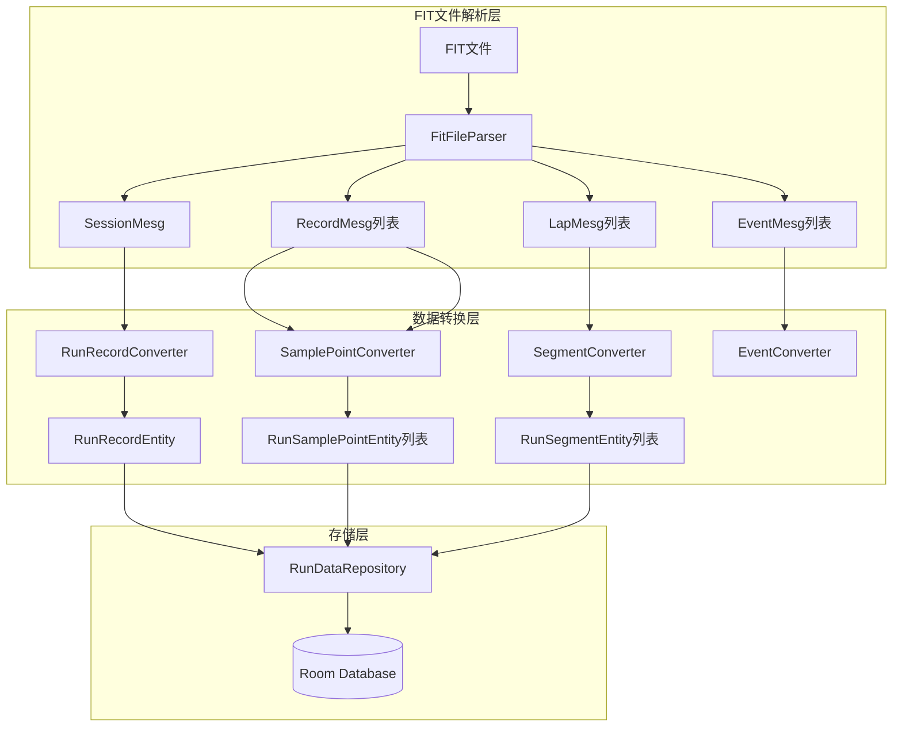

# Android FIT数据存储设计方案

## 1. 问题分析

### iOS存储问题

分析iOS代码后发现以下问题：**问题1：SeriesData分散存储** ([RunSeriesCoreDataManager.swift](zrun/ZhiRun1/managers/coredata/runRecord/RunSeriesCoreDataManager.swift))

- 每个采样点的每种数据类型（心率、功率、步频、配速等）单独存为一行
- 一个跑步活动1000个采样点 × 8种类型 = 8000行数据

**问题2：轨迹数据独立存储** ([RouteRecordCoreDataManager.swift](zrun/ZhiRun1/managers/coredata/runRecord/RouteRecordCoreDataManager.swift))

- GPS轨迹存在单独的 `RouteRecord` 表
- 每个GPS点一行，增加了额外的表关联

---

## 2. Android优化方案

### 核心优化思路

将**同一时刻**的所有采样数据（心率、功率、配速、步频、步幅、垂直振幅、触地时间）和**GPS坐标**合并为**一行存储**。**优化效果**：1000个采样点只需要1000行（iOS需要8000+行）---

## 3. 数据库表结构设计

### 3.1 RunRecord 表（跑步记录主表）

```kotlin
@Entity(tableName = "run_record")
data class RunRecordEntity(
    @PrimaryKey
    val workoutId: String,           // UUID字符串，主键
    
    // 基本信息
    val startTime: Long,             // 开始时间戳(ms)
    val endTime: Long,               // 结束时间戳(ms)
    val duration: Double,            // 总时长(分钟)
    val activeDuration: Double,      // 运动时长(分钟)
    val totalDistance: Double,       // 总距离(公里)
    val originDistance: Double,      // 原始距离(公里)
    
    // 速度配速
    val averageSpeed: Double,        // 平均配速(min/km)
    val maxSpeed: Double,            // 最快配速(min/km)
    
    // 心率
    val averageHeartRate: Double,
    val maxHeartRate: Double,
    val minHeartRate: Double,
    
    // 功率
    val averagePower: Double,
    val maxPower: Double,
    
    // 步频步幅
    val averageCadence: Double,      // 平均步频(spm)
    val averageStrideLength: Double, // 平均步幅(cm)
    
    // 跑步动态
    val averageVerticalOscillation: Double, // 垂直振幅(cm)
    val averageContactTime: Double,  // 触地时间(ms)
    
    // 消耗
    val totalCalories: Double,       // 总卡路里
    val totalStepCount: Double,      // 总步数
    val elevationAscended: Double,   // 累计爬升(米)
    
    // VDOT与训练效果
    val vdot: Double,
    val overallVdot: Double,
    val trainingEffect: Double,      // 有氧训练效果
    val anaerobicTrainingEffect: Double, // 无氧训练效果
    val trainingLoad: Double,
    
    // 环境信息
    val weatherTemperature: Double,  // 温度
    val weatherHumidity: Double,     // 湿度
    val outdoor: Int,                // 0=室外，1=室内
    
    // 设备信息
    val deviceInfo: String?,         // 设备品牌
    val deviceVersion: String?,      // 设备型号
    
    // 数据来源
    val datasource: String?,         // 平台编码(GCN/GGB/COROS等)
    val originId: String?,           // 原始活动ID
    
    // 状态标记
    val inclusiveLevel: Int,         // 数据优先级(0/1/2)
    val trajectoryStatus: Int,       // 轨迹状态(0未知/1存在/2不存在)
    val uploadStatus: Int,           // 上传状态
    
    // 用户信息
    val note: String?,               // 备注
    val feelingLevel: Int,           // 感受等级
    val address: String?,            // 地理位置
    
    // 暂停事件JSON
    val eventStr: String?,           // 暂停/恢复事件JSON
    
    // 关联ID
    val trainPlanId: String?,        // 关联训练计划
    val shoeId: String?,             // 关联跑鞋
    val linkedRaceRecordId: String?  // 关联赛事记录
)
```


### 3.2 RunSamplePoint 表（采样点表 - 核心优化）

**关键优化**：将序列数据 + GPS轨迹合并为一行

```kotlin
@Entity(
    tableName = "run_sample_point",
    foreignKeys = [ForeignKey(
        entity = RunRecordEntity::class,
        parentColumns = ["workoutId"],
        childColumns = ["workoutId"],
        onDelete = ForeignKey.CASCADE
    )],
    indices = [Index("workoutId")]
)
data class RunSamplePointEntity(
    @PrimaryKey(autoGenerate = true)
    val id: Long = 0,
    
    val workoutId: String,           // 外键关联RunRecord
    val sequence: Int,               // 序列号(从0开始)
    val timestamp: Long,             // 采样时间戳(ms)
    val timeOffset: Int,             // 距离开始时间的秒数
    
    // GPS数据（可为null表示无GPS）
    val latitude: Double?,           // 纬度(WGS84)
    val longitude: Double?,          // 经度(WGS84)
    val altitude: Double?,           // 海拔(米)
    
    // 运动指标（可为null表示该时刻无数据）
    val heartRate: Int?,             // 心率(bpm)
    val power: Int?,                 // 功率(W)
    val speed: Double?,              // 配速(min/km)
    val cadence: Int?,               // 步频(spm，已×2)
    val strideLength: Double?,       // 步幅(cm)
    val verticalOscillation: Double?,// 垂直振幅(cm)
    val contactTime: Double?,        // 触地时间(ms)
    val cumulativeDistance: Double?  // 累积距离(米)
)
```

**存储效率对比**：| 场景 | iOS行数 | Android优化行数 ||-----|---------|----------------|| 1000采样点 × 8类型 | 8000行 | 1000行 || 10km跑步(~6000点) | 48000行 | 6000行 |

### 3.3 RunSegment 表（分段表）

```kotlin
@Entity(
    tableName = "run_segment",
    foreignKeys = [ForeignKey(
        entity = RunRecordEntity::class,
        parentColumns = ["workoutId"],
        childColumns = ["workoutId"],
        onDelete = ForeignKey.CASCADE
    )],
    indices = [Index("workoutId")]
)
data class RunSegmentEntity(
    @PrimaryKey(autoGenerate = true)
    val id: Long = 0,
    
    val workoutId: String,
    val seq: Int,                    // 分段序号(从0开始)
    val segmentType: Int,            // 1=公里分段，2=训练分段
    
    // 时间信息
    val beginTime: Long,
    val endTime: Long,
    val duration: Double,            // 总时长(分钟)
    val activeDuration: Double,      // 运动时长(分钟)
    
    // 距离
    val distance: Double,            // 分段距离(公里)
    
    // 运动指标
    val averageSpeed: Double,        // 平均配速(min/km)
    val averageHeartRate: Double,
    val averagePower: Double,
    val averageCadence: Double,      // 平均步频
    val averageStrideLength: Double, // 平均步幅
    val averageVerticalOscillation: Double,
    val averageContactTime: Double,
    val stepCount: Double,           // 步数
    
    // 训练分段特有字段
    val intervalType: String?,       // warmup/work/recovery/cooldown
    val wktStepIndex: Int?,          // 训练步骤索引
    val displayName: String?         // 显示名称
)
```


### 3.4 RunAbilityZone 表（能力区间表）

```kotlin
@Entity(
    tableName = "run_ability_zone",
    foreignKeys = [ForeignKey(
        entity = RunRecordEntity::class,
        parentColumns = ["workoutId"],
        childColumns = ["workoutId"],
        onDelete = ForeignKey.CASCADE
    )],
    indices = [Index("workoutId")]
)
data class RunAbilityZoneEntity(
    @PrimaryKey(autoGenerate = true)
    val id: Long = 0,
    
    val workoutId: String,
    val zoneType: Int,               // 1=心率7区间，2=心率5区间，3=配速区间
    val zoneIndex: Int,              // 区间序号(1-7或1-5)
    val duration: Double,            // 在该区间的时长(分钟)
    val minValue: Double,            // 区间下限
    val maxValue: Double             // 区间上限
)
```

---

## 4. Room Database 定义

```kotlin
@Database(
    entities = [
        RunRecordEntity::class,
        RunSamplePointEntity::class,
        RunSegmentEntity::class,
        RunAbilityZoneEntity::class
    ],
    version = 1,
    exportSchema = true
)
@TypeConverters(Converters::class)
abstract class RunDatabase : RoomDatabase() {
    abstract fun runRecordDao(): RunRecordDao
    abstract fun runSamplePointDao(): RunSamplePointDao
    abstract fun runSegmentDao(): RunSegmentDao
    abstract fun runAbilityZoneDao(): RunAbilityZoneDao
}
```

---

## 5. DAO 接口设计

### RunRecordDao

```kotlin
@Dao
interface RunRecordDao {
    @Insert(onConflict = OnConflictStrategy.REPLACE)
    suspend fun insert(record: RunRecordEntity)
    
    @Query("SELECT * FROM run_record WHERE workoutId = :workoutId")
    suspend fun getByWorkoutId(workoutId: String): RunRecordEntity?
    
    @Query("SELECT * FROM run_record WHERE originId = :originId AND datasource = :datasource")
    suspend fun getByOriginId(originId: String, datasource: String): RunRecordEntity?
    
    @Query("SELECT * FROM run_record ORDER BY startTime DESC")
    fun getAllByStartTimeDesc(): Flow<List<RunRecordEntity>>
    
    @Delete
    suspend fun delete(record: RunRecordEntity)
}
```


### RunSamplePointDao

```kotlin
@Dao
interface RunSamplePointDao {
    @Insert
    suspend fun insertAll(points: List<RunSamplePointEntity>)
    
    @Query("SELECT * FROM run_sample_point WHERE workoutId = :workoutId ORDER BY sequence")
    suspend fun getByWorkoutId(workoutId: String): List<RunSamplePointEntity>
    
    // 获取GPS轨迹点
    @Query("SELECT * FROM run_sample_point WHERE workoutId = :workoutId AND latitude IS NOT NULL ORDER BY sequence")
    suspend fun getTrackPoints(workoutId: String): List<RunSamplePointEntity>
    
    // 获取特定类型数据用于图表
    @Query("SELECT sequence, timeOffset, heartRate FROM run_sample_point WHERE workoutId = :workoutId AND heartRate IS NOT NULL ORDER BY sequence")
    suspend fun getHeartRateSeries(workoutId: String): List<HeartRatePoint>
    
    @Query("DELETE FROM run_sample_point WHERE workoutId = :workoutId")
    suspend fun deleteByWorkoutId(workoutId: String)
}
```

---

## 6. Repository 接口设计

```kotlin
interface RunDataRepository {
    // 保存完整跑步数据（包含采样点和分段）
    suspend fun saveRunRecord(
        record: RunRecordEntity,
        samplePoints: List<RunSamplePointEntity>,
        segments: List<RunSegmentEntity>,
        zones: List<RunAbilityZoneEntity>
    )
    
    // 去重检查
    suspend fun existsByOriginId(originId: String, datasource: String): Boolean
    
    // 获取跑步记录详情
    suspend fun getRunDetail(workoutId: String): RunDetailData?
    
    // 获取GPS轨迹
    suspend fun getTrackPoints(workoutId: String): List<TrackPoint>
    
    // 获取图表数据
    suspend fun getHeartRateSeries(workoutId: String): List<ChartDataPoint>
    suspend fun getSpeedSeries(workoutId: String): List<ChartDataPoint>
}
```

---

## 7. 数据流向图



---

## 8. 文件结构规划（rundemo模块）

在 `rundemo` 模块中实现，遵循现有的Clean Architecture + MVVM架构：

```javascript
rundemo/src/main/java/com/oterman/rundemo/
├── data/
│   ├── local/
│   │   ├── PreferencesManager.kt          # 已有
│   │   ├── database/                       # 新增
│   │   │   ├── RunDatabase.kt             # Room数据库定义
│   │   │   └── Converters.kt              # 类型转换器
│   │   ├── dao/                            # 新增
│   │   │   ├── RunRecordDao.kt
│   │   │   ├── RunSamplePointDao.kt
│   │   │   ├── RunSegmentDao.kt
│   │   │   └── RunAbilityZoneDao.kt
│   │   └── entity/                         # 新增
│   │       ├── RunRecordEntity.kt
│   │       ├── RunSamplePointEntity.kt
│   │       ├── RunSegmentEntity.kt
│   │       └── RunAbilityZoneEntity.kt
│   ├── network/                            # 已有
│   └── repository/
│       ├── UserRepository.kt               # 已有
│       ├── RunDataRepository.kt            # 新增：接口定义
│       └── RunDataRepositoryImpl.kt        # 新增：实现
├── domain/
│   └── model/
│       ├── UserInfo.kt                     # 已有
│       ├── RunRecord.kt                    # 新增：领域模型
│       ├── RunSegment.kt                   # 新增
│       ├── TrackPoint.kt                   # 新增
│       └── ChartDataPoint.kt               # 新增
└── util/
    ├── Constants.kt                        # 已有
    ├── Logger.kt                           # 已有
    └── FitDataConverter.kt                 # 新增：FIT数据转换器
```

**说明**：

- `fitdemo` 模块仅用于FIT解析测试，不涉及数据存储
- 后续FIT解析逻辑也会迁移到 `rundemo` 模块中

---

## 9. 实施步骤

1. **添加Room依赖** - 在 `rundemo/build.gradle.kts` 中添加 Room 库
2. **创建Entity类** - 在 `data/local/entity/` 下定义4个表的实体类
3. **创建DAO接口** - 在 `data/local/dao/` 下定义CRUD操作
4. **创建Database类** - 在 `data/local/database/` 下配置Room数据库
5. **实现Repository** - 在 `data/repository/` 下封装数据存储接口
6. **创建Domain Model** - 在 `domain/model/` 下创建领域模型