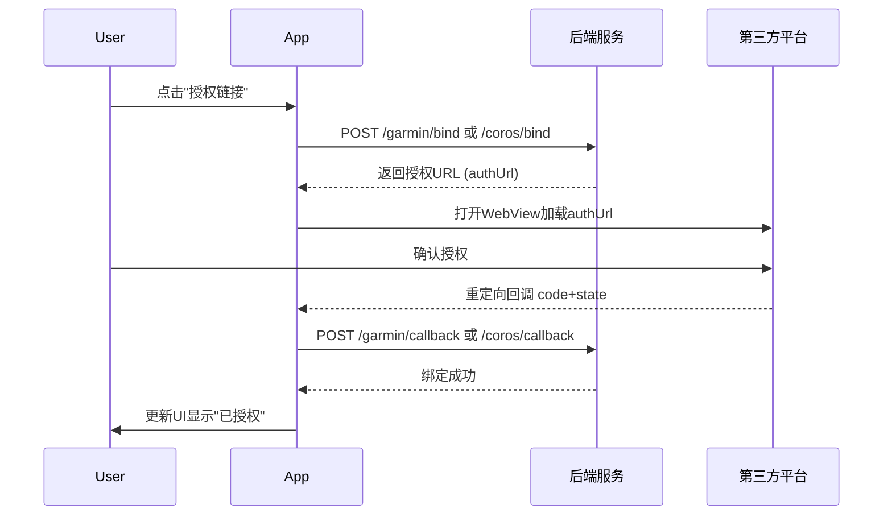

# Android 数据源管理功能实现方案

## 一、功能概述

基于iOS `DataSourceManagePage` 的参考实现，为Android rundemo模块实现完整的数据源管理功能，支持：

- 佳明中国 (GCN)
- 佳明国际 (GGB)
- COROS 高驰 (COROS)

## 二、iOS实现分析要点

### 核心组件

| iOS组件 | 功能 | Android对应 ||---------|------|-------------|| `DataSourceManagePage` | 数据源列表管理 | `DataSourceManageScreen` || `DataSourceDetailPage` | 单个数据源详情/授权 | `DataSourceDetailScreen` || `DataSourceManagementViewModel` | 状态管理 | `DataSourceManageViewModel` || `GarminDataSyncService` | 佳明数据同步 | `GarminSyncService` || `CorosDataSyncService` | 高驰数据同步 | `CorosSyncService` || `DataSourcePlatform` | 平台枚举 | `DataSourcePlatform` |

### OAuth授权流程




## 三、Android架构设计

### 1. 目录结构

```javascript
rundemo/src/main/java/com/oterman/rundemo/
├── data/
│   ├── network/
│   │   ├── api/
│   │   │   └── DataSourceApi.kt              // 数据源相关API接口
│   │   └── dto/
│   │       ├── request/
│   │       │   ├── PlatformBindRequest.kt    // 绑定请求
│   │       │   ├── PlatformCallbackRequest.kt// 回调请求
│   │       │   ├── PlatformUnbindRequest.kt  // 解绑请求
│   │       │   └── FileListRequest.kt        // 文件列表请求
│   │       └── response/
│   │           ├── PlatformStatusResponse.kt // 平台状态响应
│   │           ├── PlatformBindResponse.kt   // 绑定响应
│   │           └── FileListResponse.kt       // 文件列表响应
│   ├── local/
│   │   └── DataSourcePreferences.kt          // 数据源本地偏好存储
│   └── repository/
│       └── DataSourceRepository.kt           // 数据源仓库
├── domain/
│   └── model/
│       ├── DataSourcePlatform.kt             // 平台枚举
│       ├── DataSourceInfo.kt                 // 数据源信息
│       └── SyncResult.kt                     // 同步结果
├── presentation/
│   ├── feature/
│   │   └── datasource/
│   │       ├── DataSourceManageScreen.kt     // 数据源管理主页面
│   │       ├── DataSourceManageViewModel.kt  // 管理页ViewModel
│   │       ├── DataSourceManageUiState.kt    // 管理页UI状态
│   │       ├── DataSourceDetailScreen.kt     // 数据源详情页面
│   │       ├── DataSourceDetailViewModel.kt  // 详情页ViewModel
│   │       ├── DataSourceDetailUiState.kt    // 详情页UI状态
│   │       ├── OAuthWebViewScreen.kt         // OAuth授权WebView
│   │       └── components/
│   │           ├── DataSourceItem.kt         // 数据源列表项
│   │           └── SyncStatusCard.kt         // 同步状态卡片
│   └── navigation/
│       └── Screen.kt                         // 新增路由
└── service/
    └── sync/
        ├── DataSyncService.kt                // 数据同步服务接口
        ├── GarminSyncService.kt              // 佳明同步服务
        └── CorosSyncService.kt               // 高驰同步服务
```


### 2. 数据模型设计

```kotlin
// 平台枚举
enum class DataSourcePlatform(
    val code: String,
    val displayName: String,
    val iconResId: Int,
    val isEnabled: Boolean = true
) {
    GARMIN_CHINA("GCN", "佳明(中国)", R.drawable.icon_garmin, true),
    GARMIN_GLOBAL("GGB", "佳明(国际)", R.drawable.icon_garmin, true),
    COROS("COROS", "COROS 高驰", R.drawable.icon_coros, true),
    HUAWEI("HUAWEI", "华为运动健康", R.drawable.icon_huawei, false)
}
```


### 3. API接口设计

参考iOS的`NetApiConstants`和服务端API文档：| 接口 | 方法 | 用途 ||------|------|------|| `/api/user/platform/status` | POST | 查询平台绑定状态 || `/garmin/bind` | POST | 获取佳明授权URL || `/garmin/callback` | POST | 佳明授权回调 || `/garmin/unbind` | POST | 解绑佳明 || `/garmin/file/list` | POST | 获取待同步文件列表 || `/garmin/file/download` | POST | 下载FIT文件 || `/garmin/china/backfill` | POST | 佳明中国数据回填 || `/coros/bind` | POST | 获取高驰授权URL || `/coros/callback` | POST | 高驰授权回调 || `/coros/unbind` | POST | 解绑高驰 |

### 4. UI设计

#### 数据源管理页面 (DataSourceManageScreen)

- 顶部大标题 "数据源管理" (支持滚动折叠)
- 数据源列表：显示所有数据源，每项包含图标、名称、授权状态、优先级徽章
- 底部"调整数据源优先级"按钮 (进入拖拽排序模式)
- 编辑模式下支持长按拖拽排序

#### 数据源详情页面 (DataSourceDetailScreen)

- 顶部：跑鸭图标 ⟷ 链接符号 ⟷ 平台图标
- 中部：说明文字列表
- 同步状态区域 (显示实时导入进度)
- 底部按钮：
- 未授权：显示"授权链接"
- 已授权：显示"手动同步" + "取消授权"

## 四、实现步骤

### 阶段一：基础架构

1. 创建数据模型和枚举类
2. 实现DataSourceApi接口
3. 实现DataSourceRepository
4. 添加本地偏好存储 (授权状态、优先级)

### 阶段二：UI实现

1. 创建DataSourceManageScreen及其ViewModel
2. 创建DataSourceDetailScreen及其ViewModel
3. 实现OAuthWebViewScreen (用于OAuth授权流程)
4. 添加导航路由

### 阶段三：授权功能

1. 实现平台状态查询
2. 实现OAuth授权流程 (获取URL → WebView → 回调处理)
3. 实现解绑功能

### 阶段四：数据同步

1. 创建DataSyncService接口
2. 实现GarminSyncService (文件列表获取、下载、解析)
3. 实现CorosSyncService
4. 复用现有FIT解析和存储逻辑

### 阶段五：集成测试

1. 从ProfileTab添加入口
2. 端到端授权流程测试
3. 数据同步流程测试

## 五、关键实现细节

### OAuth WebView处理

```kotlin
// 拦截重定向URL，提取code和state
webViewClient = object : WebViewClient() {
    override fun shouldOverrideUrlLoading(view: WebView, request: WebResourceRequest): Boolean {
        val url = request.url.toString()
        if (url.startsWith("https://yayarun.cn/oauth/") || 
            url.startsWith("https://yayarun.cn/coros/callback")) {
            // 提取code和state参数
            val code = Uri.parse(url).getQueryParameter("code")
            val state = Uri.parse(url).getQueryParameter("state")
            if (code != null && state != null) {
                onAuthCallback(code, state)
            }
            return true
        }
        return false
    }
}
```


### 数据同步流程

复用现有的FIT解析逻辑 (`FitFileParser`, `FitDataMapper`, `RunDataRepository`)：

```kotlin
// 同步流程伪代码
suspend fun syncData() {
    // 1. 获取文件列表
    val files = api.getFileList(userId, lastSyncTime)
    
    // 2. 过滤已导入文件
    val newFiles = files.filter { !repository.existsByOriginId(it.summaryId) }
    
    // 3. 下载并解析每个文件
    newFiles.forEach { file ->
        val fitData = api.downloadFile(file)
        val record = FitFileParser.parse(fitData)
        repository.saveRunRecord(record)
        emit(ImportProgress(file.summaryId, record))
    }
}
```


## 六、入口集成

在 `ProfileTabContent` 中添加数据源管理入口：

```kotlin
SettingsItem(
    icon = Icons.Outlined.CloudSync,
    title = "数据源管理",
    subtitle = "佳明、高驰等平台数据同步",


```