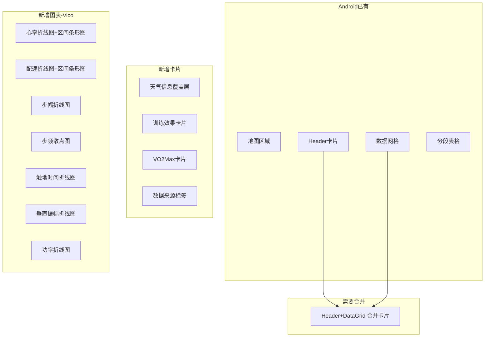

# RunDetailScreen 对标 iOS V3 详情页实施方案

## 现状分析

**Android 已有组件：**

- `RunDetailMapSection` - 地图轨迹展示（60%屏幕高度+渐变遮罩）
- `RunDetailHeaderCard` - 距离/时间/设备信息+头像
- `RunDetailDataGrid` - 3列指标网格（独立卡片）
- `RunDetailSegmentTable` - 公里分段表格
- `RunDetailViewModel` - 基础数据加载（record, trackPoints, segments, metrics）
- Repository 层已有 `getHeartRateSeries`, `getSpeedSeries`, `getCadenceSeries`, `getPowerSeries`, `getHeartRate7Zones`, `getHeartRate5Zones`, `getSpeedZones` 等接口

**iOS V3 有但 Android 缺失的功能模块：**



## 页面内容顺序（对齐 iOS）

1. 地图区域（60%高度）+ 天气覆盖层（左下角）
2. Header + DataGrid 合并卡片（向上侵入地图 -25dp）
3. 训练效果卡片（条件：trainingEffect > 0）
4. VO2Max 卡片（条件：vdot > 0）
5. 公里分段表格
6. 心率图表 + 心率区间条形图
7. 配速图表 + 配速区间条形图
8. 步幅图表（条件显示）
9. 步频图表（条件显示）
10. 触地时间图表（条件显示）
11. 垂直振幅图表（条件显示）
12. 功率图表（条件显示）
13. 数据来源标签

## 技术方案

### 1. 添加 Vico 依赖

在 [rundemo/build.gradle.kts](rundemo/build.gradle.kts) 中添加：

```kotlin
implementation("com.patrykandpatrick.vico:compose-m3:2.1.0-beta.1")
```

### 2. 扩展 ViewModel 和 UiState

**[RunDetailUiState.kt](rundemo/src/main/java/com/oterman/rundemo/presentation/feature/rundetail/RunDetailUiState.kt)** 新增字段：

- `heartRateSeries: List<ChartDataPoint>` - 心率时序
- `speedSeries: List<ChartDataPoint>` - 配速时序
- `cadenceSeries: List<ChartDataPoint>` - 步频时序
- `powerSeries: List<ChartDataPoint>` - 功率时序
- `strideLengthSeries: List<ChartDataPoint>` - 步幅时序（从 samplePoints 构建）
- `verticalOscillationSeries: List<ChartDataPoint>` - 垂直振幅时序
- `contactTimeSeries: List<ChartDataPoint>` - 触地时间时序
- `heartRateZones: List<AbilityZone>` - 心率区间
- `speedZones: List<AbilityZone>` - 配速区间
- `trainingSegments: List<RunSegment>` - 训练分段

**[RunDetailViewModel.kt](rundemo/src/main/java/com/oterman/rundemo/presentation/feature/rundetail/RunDetailViewModel.kt)** 扩展：

- `loadData()` 中增加对图表数据、区间数据的加载
- 从 `getSamplePoints()` 构建步幅/垂直振幅/触地时间序列（Repository 未暴露这三个 series 接口，需从 samplePoints 转换）
- 新增 `loadChartData()` 方法异步加载图表数据

### 3. Repository 层扩展

在 [RunDataRepository.kt](rundemo/src/main/java/com/oterman/rundemo/data/repository/RunDataRepository.kt) 和实现类中新增：

- `getStrideLengthSeries(workoutId): List<ChartDataPoint>` 
- `getVerticalOscillationSeries(workoutId): List<ChartDataPoint>`
- `getContactTimeSeries(workoutId): List<ChartDataPoint>`

> 这三个方法从 `RunSamplePointEntity` 中提取对应字段构建时序数据。

### 4. 新增/改造 UI 组件

| 组件 | 文件 | 说明 |

|------|------|------|

| 合并卡片 | `RunDetailHeaderDataCard.kt` | 将 Header + DataGrid 合并为一张卡片，中间用 Divider 分隔 |

| 天气覆盖层 | `RunDetailWeatherOverlay.kt` | 地图左下角显示温度/湿度 |

| 训练效果 | `TrainingEffectCard.kt` | 有氧/无氧训练效果双列展示+进度环 |

| VO2Max | `VO2MaxCard.kt` | VO2Max 数值展示 |

| 通用图表 | `RunDataLineChart.kt` | 基于 Vico 的折线图组件（标题+max/avg信息+折线+平均线） |

| 区间条形图 | `AbilityZoneBar.kt` | 心率/配速区间的水平条形图 |

| 心率图表卡片 | `HeartRateChartCard.kt` | 心率折线图 + 区间条形图 组合卡片 |

| 配速图表卡片 | `PaceChartCard.kt` | 配速折线图 + 区间条形图 组合卡片 |

| 数据来源标签 | 内联在 RunDetailScreen | 底部居中文本 |

### 5. RunDetailScreen 主布局改造

改造 [RunDetailScreen.kt](rundemo/src/main/java/com/oterman/rundemo/presentation/feature/rundetail/RunDetailScreen.kt) 的 LazyColumn 内容：

```kotlin
LazyColumn {
    // 1. 地图 + 天气
    item { RunDetailMapSection(...) }
    
    // 2. 合并的 Header+DataGrid 卡片
    item { RunDetailHeaderDataCard(...) }
    
    // 3. 训练效果（条件）
    if (trainingEffect > 0) item { TrainingEffectCard(...) }
    
    // 4. VO2Max（条件）
    if (vdot > 0) item { VO2MaxCard(...) }
    
    // 5. 公里分段
    if (segments.isNotEmpty()) item { RunDetailSegmentTable(...) }
    
    // 6. 心率图表 + 区间
    if (heartRateSeries.isNotEmpty()) item { HeartRateChartCard(...) }
    
    // 7. 配速图表 + 区间
    if (speedSeries.isNotEmpty()) item { PaceChartCard(...) }
    
    // 8-12. 其他图表（步幅/步频/触地时间/垂直振幅/功率）
    // 每个都用 RunDataLineChart 组件，条件显示
    
    // 13. 数据来源标签
    item { DataSourceLabel(datasource) }
}
```

### 6. Vico 图表设计要点

对齐 iOS 图表交互：

- 折线图使用 `CartesianChart` + `rememberLineCartesianLayer`
- X 轴为时间偏移（秒转分钟显示）
- Y 轴自适应数据范围
- 平均线使用 `HorizontalLine` 装饰
- 配速图 Y 轴反转（小值在上=更快）
- 区间条形图使用自定义 Compose 组件（水平条+百分比+时长）
- 暂停标记线可通过 `VerticalLine` 装饰实现

> 注意：Vico 原生支持缩放和长按交互，但可能不如 iOS Swift Charts 灵活。第一版先实现基础折线图展示+区间条形图，后续迭代增加长按查看数值和缩放功能。