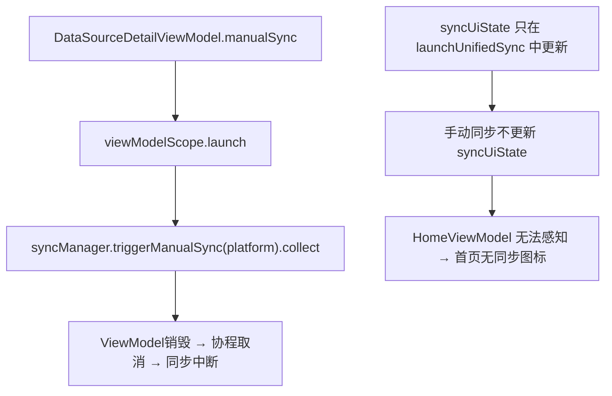
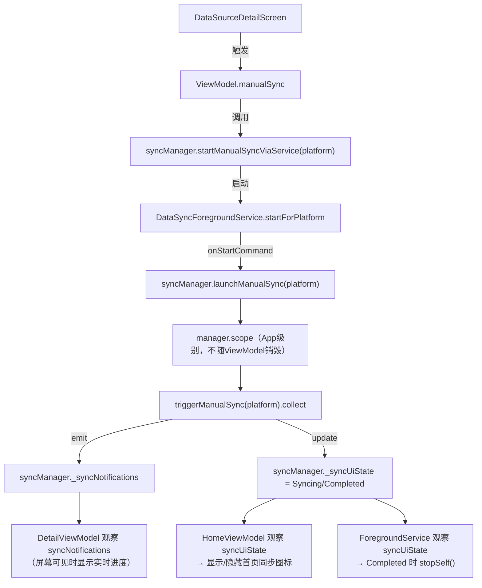

# 手动同步后台持续化方案

## 当前架构问题




## 目标架构




## 修改文件

### 1. `[UnifiedDataSyncManager.kt](rundemo/src/main/java/com/oterman/rundemo/service/sync/UnifiedDataSyncManager.kt)`

新增 `launchManualSync(platform)` 方法，与现有 `launchUnifiedSync()` 同级：

- 运行在 `manager.scope`（App 级别单例，不受 ViewModel 生命周期影响）
- 调用 `isAnySyncing()` 防重复
- 更新 `_syncUiState` 为 `Syncing` / `Completed` / `Idle`
- 将每条通知 `tryEmit` 到 `_syncNotifications`（供 DetailViewModel 实时消费）

新增 `startManualSyncViaService(platform)` 方法（因 ViewModel 无 Context，由 manager 代理启动 service）：

```kotlin
fun startManualSyncViaService(platform: DataSourcePlatform) {
    DataSyncForegroundService.startForPlatform(context, platform)
}
```

### 2. `[DataSyncForegroundService.kt](rundemo/src/main/java/com/oterman/rundemo/service/sync/DataSyncForegroundService.kt)`

在 `companion object` 中新增：

- 常量 `EXTRA_PLATFORM = "extra_platform"`
- 静态方法 `startForPlatform(context, platform)`：将 platform.code 写入 Intent extras 后启动前台服务

修改 `onStartCommand`：

- 解析 `EXTRA_PLATFORM` extras
- 有平台：调用 `manager.launchManualSync(platform)` 
- 无平台（兜底）：调用 `manager.launchUnifiedSync()`（保持原有行为不变）

### 3. `[DataSourceDetailViewModel.kt](rundemo/src/main/java/com/oterman/rundemo/presentation/feature/datasource/DataSourceDetailViewModel.kt)`

重构 `manualSync()` 方法：

- **移除** `viewModelScope.launch { syncManager.triggerManualSync(...).collect {...} }`
- **改为** 调用 `syncManager.startManualSyncViaService(platform)`（触发 Service → manager.scope 中运行）
- 本地设置 `isSyncing = true` 初始 UI 状态

新增 `observeSyncState()` 在 `init` 中调用：

- 观察 `syncManager.syncUiState`：`Syncing` → `isSyncing=true`；`Completed/Idle` → `isSyncing=false, isSyncFinished=true`
- 观察 `syncManager.syncNotifications`（过滤本平台）：更新 `importedRecords` 列表

新增初始化检查（用户返回时恢复状态）：

```kotlin
init {
    loadDataSourceInfo()
    observeSyncState()
    // 若当前已在同步中，恢复 isSyncing = true
    if (syncManager.isAnySyncing()) {
        _uiState.update { it.copy(isSyncing = true) }
    }
}
```

### 无需修改

- `HomeViewModel.kt` — 已通过 `syncUiState` 观察，`launchManualSync` 更新 `syncUiState` 后自动生效
- `HomeScreen` / `HomeTab.kt` — 已有 `RotatingSyncIcon` 逻辑，无需改动
- `DataSourceDetailScreen.kt` — 无需改动（由 ViewModel 内部驱动）
- `DataSourceDetailViewModelFactory.kt` — 无需改动（syncManager 已有 context）

## 关键约束

- `launchManualSync` 内部调用 `isAnySyncing()` 检查，满足需求#3（全局防重复）
- `startManualSyncViaService` 调用 `DataSyncForegroundService.startForPlatform` 前也检查 `isAnySyncing()`，双重保护
- `DetailViewModel` 通过 `syncNotifications` 观察（而非收集冷 Flow）实现界面存活时实时显示，退出后由 Service 接管

