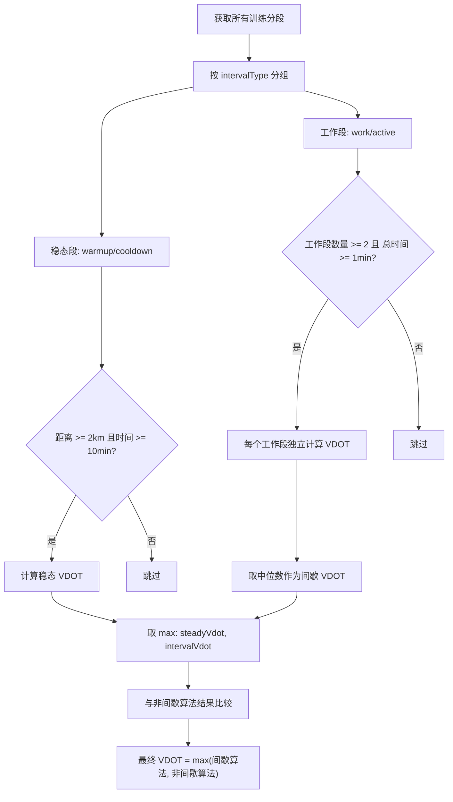

# 间歇跑 VDOT 算法优化

## 问题分析

### 缺陷 1："active" 类型未被识别为工作段（最可能的直接 Bug）

在 Garmin FIT SDK 中，结构化训练的"工作段"使用 `intensity=0`（ACTIVE），而非 `intensity=5`。当前代码：

```276:285:rundemo/src/main/java/com/oterman/rundemo/data/fit/FitDataMapper.kt
// convertIntensity 映射：
// 0 -> "active"   <-- Garmin 标准的工作段
// 5 -> "work"     <-- 实际 FIT 文件中几乎不会出现
```

但 `calculateFromSegmentsWithResult` 的过滤条件只认 "work"、"warmup"、"cooldown"：

```453:459:rundemo/src/main/java/com/oterman/rundemo/data/fit/VdotCalculator.kt
if (type == "work" || type == "warmup" || type == "cooldown") {
    sumDistance += seg.distance
    sumTime += seg.activeDuration
    sumHeartRate += seg.averageHeartRate * seg.activeDuration
}
```

**后果**：当 FIT 文件有 intensity 字段时，真正的工作段（"active"）被排除，只有 warmup/cooldown 参与计算，VDOT 仅反映慢速热身/放松。

同样，`FitRecordProcessor` 的间歇检测逻辑也遗漏了 "active"：

```295:298:rundemo/src/main/java/com/oterman/rundemo/data/fit/FitRecordProcessor.kt
val hasIntervalTraining = segments.any { seg ->
    val type = seg.intervalType
    !type.isNullOrEmpty() && (type == "work" || type == "warmup" || type == "cooldown")
}
```

### 缺陷 2：热身/放松"稀释"间歇训练表现

当前算法将所有 warmup + work + cooldown 段简单叠加为一次"虚拟长跑"。当 10km 热身（~~50 分钟）与 6x20s 间歇（~~2 分钟）合并后：

- 热身占比 **96%**，间歇贡献被完全淹没
- 平均配速趋近于热身配速，VDOT 仅反映慢跑能力
- Daniels 公式的效率因子 `f` 按 52 分钟计算（长跑衰减），而非按间歇的短时间计算

### 缺陷 3：缺少兜底机制

间歇算法没有与非间歇算法比较的逻辑。当间歇算法产生异常低值时，没有回退保护。

## 解决方案

### 核心思路：分组件独立评估 + 取最优

将训练分段按类型分为**稳态段**（warmup/cooldown）和**间歇工作段**（work/active），分别计算 VDOT，取较高值作为最终结果。




### 修改文件

#### 1. [VdotCalculator.kt](rundemo/src/main/java/com/oterman/rundemo/data/fit/VdotCalculator.kt) - 核心改动

重写 `calculateFromSegmentsWithResult` 方法：

- **修复 "active" 类型**：将 "active" 视为 "work" 的同义词
- **分组件评估**：
  - 稳态段（warmup/cooldown 合并）：如果距离 >= 2km、时间 >= 10min，调用 `calculateWithResult` 得到稳态 VDOT
  - 间歇工作段：逐个计算每个工作段的 VDOT（避免短距离聚合的惩罚），取中位数
- **取最优结果**：`max(steadyVdot, intervalVdot)`，confidence 取对应的较高方的置信度
- 增加方法签名参数以支持兜底比较（传入 RunRecordEntity 的总距离/总时间/平均心率）

工作段逐个计算 VDOT 的逻辑：

- 对每个 work/active 段，用其自身 distance 和 activeDuration 调用 `getVDot`
- 过滤掉 VDOT <= 0 的无效结果
- 取所有有效 VDOT 的中位数
- 对中位数结果使用工作段的平均心率做心率修正

#### 2. [FitRecordProcessor.kt](rundemo/src/main/java/com/oterman/rundemo/data/fit/FitRecordProcessor.kt) - 调整调用

- 在 `hasIntervalTraining` 检测中加入 "active" 类型
- 在 `calculateVdot` 中增加兜底逻辑：如果间歇算法结果低于非间歇算法结果，使用非间歇算法结果

#### 3. [FitDataMapper.kt](rundemo/src/main/java/com/oterman/rundemo/data/fit/FitDataMapper.kt) - 可选优化

- 考虑将 `convertIntensity(0)` 从 "active" 改为 "work"，统一术语（影响范围需评估）
- 或者保持 "active" 不变，在 VdotCalculator 中同时识别两种名称（更安全，影响范围小）

## 关键设计决策


| 决策点         | 方案                           | 理由                                    |
| ----------- | ---------------------------- | ------------------------------------- |
| "active" 处理 | 在计算逻辑中同时匹配 "active" 和 "work" | 不修改 FitDataMapper 映射，避免影响 UI 展示和其他消费方 |
| 间歇 VDOT 计算  | 逐个工作段独立计算，取中位数               | 避免短距离聚合导致 getVDotSpeedParam 惩罚过重      |
| 稳态 vs 间歇    | 取 max                        | VDOT 衡量跑步能力上限，高强度间歇应能体现更高能力           |
| 兜底          | 间歇算法结果不低于非间歇算法               | 间歇算法是优化，不应让结果更差                       |
| 最低工作段要求     | 至少 2 个段 且 总时间 >= 1 分钟        | 避免单个极短段产生不可靠结果                        |


